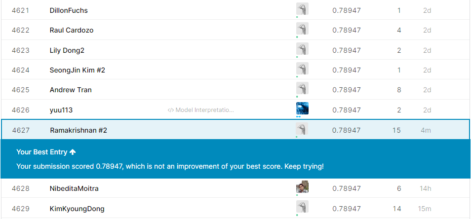

# Titanic : Appyling ML to predict the survival on the Titanic
### Data Source 
Data can be either dowloaded from my <a href = "https://github.com/ramakrishnan-21/Titanic-ml">GitHub profile</a> or directly download from <a href = "https://www.kaggle.com/c/titanic/data">kaggle</a>
### Description
The Titanic challenge on <a href = "www.kaggle.com">Kaggle</a> is a competition in which the task is to predict the survival or the death of a given passenger based on a set of variables describing him such as his age, his sex, or his passenger class on the boat. I have been working with the Titanic dataset for a while, and I have recently achieved an accuracy score of 0.7894 on the public leaderboard.More than 21,600 teams are currently competing.
 In this article my solution goes through the following steps
 * Exploratory Data Analysis
 * Feature Extraction
 * Feature Engineering
 * Model Building
## Prerequisites
You need to have installed following softwares and libraries in your machine before running this project.
* Python 3
* Anaconda: It will install ipython notebook and most of the libraries which are needed like sklearn, pandas, seaborn, matplotlib, numpy, scipy.
## Installing
* Python 3: https://www.python.org/downloads/
* Anaconda: https://www.anaconda.com/download/
 
 I recently achieved an accuracy score of 0.78947 on the public leaderboard.  I am ranked among the top 20% of all Kagglers : More than 21650
 teams are currently competing.

 
 
 
 I would be happy if you could find out a way to improve my solution. This could make me update the article and definitely give you credit for that. So feel free to post a comment.
 ## Authors
 Ramakrishnan - Complete Work
